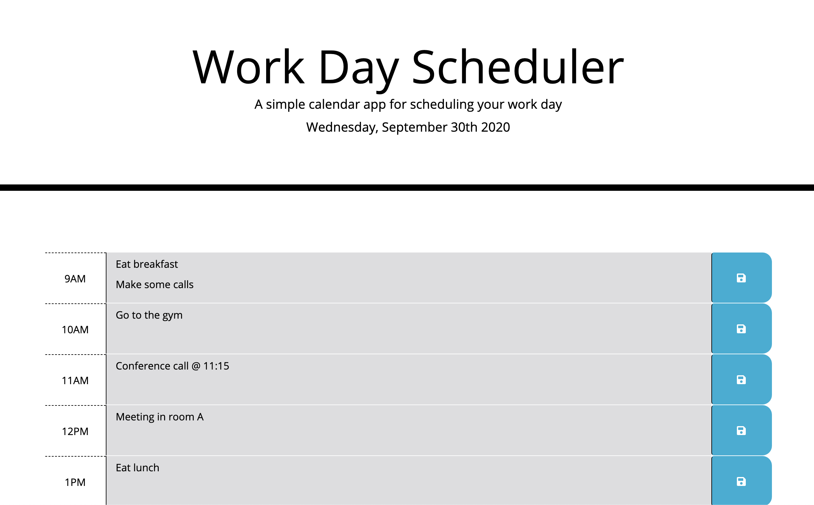
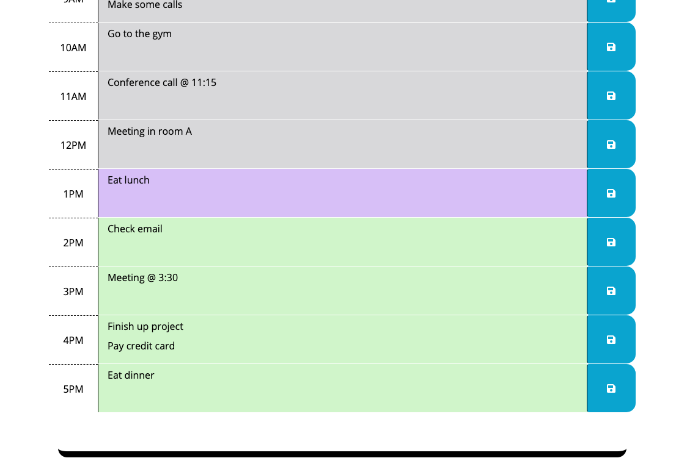

https://alexandra-hionis.github.io/Daily-Work-Planner/
# Daily-Work-Planner
This is a simple calendar application that allows a user to save events for each hour of the day. Work days can be stressful enough, so this daily work planner can help managage and organize your day. Synced to the actual time of the day, you can see that the greyed out portion represents past hours, purple represents the current hour, and green refers to future hours. If you exit your browser, the planner will remain just as you left it last. 

# Under the Hood
This app will run in the browser and feature dynamically updated HTML and CSS powered by jQuery. It uses bootstrap to ensure it's responsive along with Moment.js to get the current date and time. The application user experience is intuitive and easy to navigate, as well as clean and polished.

